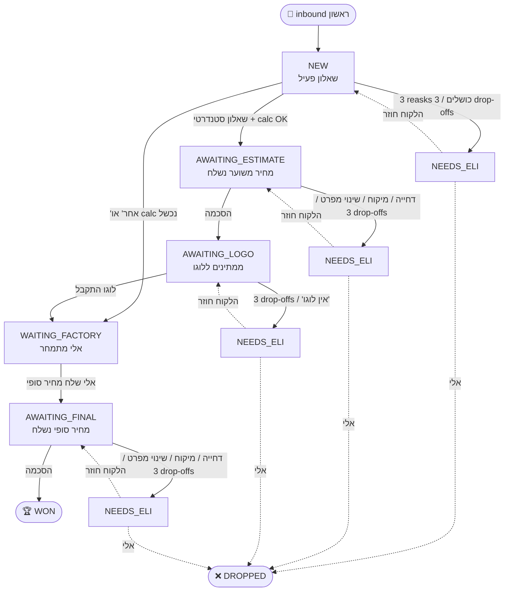

# Albadi — Customer Flow (bot-agnostic) — **source of truth ל-customer journey**

> ✅ מסע הלקוח מנקודת מבט של העסק. כל use case + ההחלטה של אלי.
>
> מסמכים נלווים:
> - **PRD** = [PRD.md](./PRD.md) — why + outcomes + מדדים.
> - **Feature inventory** = [FEATURES.md](./FEATURES.md) — מה shipped/beta/deprecated.
> - **Architecture** = [ARCHITECTURE.md](./ARCHITECTURE.md) — איך זה בנוי בקוד (מחליף את `archive/FOLLOWUP-SPEC.md`).
> - **Bot copy** = [BOT-COPY.md](./BOT-COPY.md) — נוסחים מלאים.
>
> במקרה של סתירה בין המסמך הזה לבין הקוד — **המסמך הזה גובר.** דרייפט בקוד נרשם ב-ARCHITECTURE §drift.

נכתב 2026-05-13. מתעדים שלב-שלב, כל use case שעולה, וההחלטה של אלי לכל אחד.
"let's move on" = השלב/תת-נושא הזה סגור, ממשיכים הלאה.

---

## Stages (מצבי ה-lead)

כל lead נמצא ב-**stage** אחד מתוך הרשימה למטה. בנוסף יכול להיות עם **flags** רוחביים.

### Stages

מקור אמת. מקביל ל-`V2_PIPELINE_STAGES` ב-`lib/manychat/stages.ts`. סך הכל 7 stages קנוניים.

| # | Stage | מתי נכנסים | מתי יוצאים | מי משנה |
|---|---|---|---|---|
| 1 | `NEW` | first inbound | סיום שאלון | בוט |
| 2 | `AWAITING_ESTIMATE` | סיום שאלון סטנדרטי + נשלח מחיר משוער + "מתאים?" | הסכמה / דחייה / שינוי מפרט | בוט |
| 3 | `AWAITING_LOGO` | הלקוח הסכים למחיר משוער → התבקש לוגו | לוגו התקבל / drop-off | בוט |
| 4 | `WAITING_FACTORY` | "אחר" בשאלון / calc API נכשל / לוגו התקבל וצריך מחיר סופי / לקוח ביקש שיחה | אלי שולח מחיר ידני / סוגר ידנית | בוט נכנס, אלי יוצא |
| 5 | `AWAITING_FINAL` | אלי שלח מחיר סופי | הסכמה → WON / דחייה / מיקוח | בוט |
| 6 | `WON` | הלקוח הסכים למחיר הסופי | סוף (סטטוס סופי) | בוט |
| 7 | `DROPPED` | אלי החליט שהליד מת | סוף (סטטוס סופי) | **רק אלי** |

> **סאב-state ב-qState, לא stage נפרד:**
> - מיקוח ("יקר") → נשאר ב-`AWAITING_ESTIMATE` עם `qState.decisionState='awaiting_competitor_offer'` ו-NEEDS_ELI flag.
> - בקשת שיחה → `WAITING_FACTORY` + NEEDS_ELI + tag `ביקש_שיחה`.
> - לוגו התקבל → `WAITING_FACTORY` + NEEDS_ELI (אלי מעבד לקראת מחיר סופי).

### Flags (רוחביים — יכולים להתלוות לכל stage)

מקור אמת = `lib/manychat/stages.ts:V2_FLAG_TAG_IDS`. ניתנים לעריכה ידנית מה-dashboard.

| Flag | סוג | משמעות |
|---|---|---|
| `NEEDS_ELI` | מערכת (pipelineFlag) | דורש טיפול ידני של אלי. הוצב על ידי הבוט בכל escalation. |
| `bot_paused` | מערכת (botPaused boolean) | הבוט לא ישלח שום דבר ללקוח. מוסר אוטומטית כשהלקוח שולח הודעה חדשה. |
| `דחוף` | אופציונלי | תיוג לקוח שרוצה אספקה דחופה (אקספרס). |
| `עסקה_גדולה` | אופציונלי | תיוג high-value (1000₪+). |
| `ביקש_שיחה` | אופציונלי | הלקוח ביקש לדבר בטלפון. |
| `אחרי_החג` | אופציונלי | תיוג cadence: לחזור אחרי החג הקרוב. |
| `מועדף` | אופציונלי | star marker — לידים שצריך לתעדף. |

### תרשים זרימה

---

## שלב 1 — Inbound ראשון → שאלון

**Trigger:** לקוח (חדש או קיים) שולח הודעה ב-WhatsApp.
**פעולה:** שולחים את השאלון.

### תת-נושא 1.1 — הלקוח לא עונה לשאלון "כמו שצריך"

**הגדרה:** השאלון נשלח (או באמצע). הלקוח כתב משהו שהוא לא תשובה תקינה לשאלה הנוכחית.

**Use cases שכלולים:**
- A. שתיקה מוחלטת
- B. תשובה זבל ("ok", "תודה", אימוג'י, "מי זה?")
- C. שאלה במקום תשובה ("כמה זה עולה?", "מה המינימום?")
- D. Dump של מפרט מלא ("רוצה 5000 30x40 עם ידיות express")
- E. הודעה קולית
- F. תמונה / קובץ
- G. בקש שיתקשרו ("תתקשר אליי 050-...")
- H. בקש דוגמאות / קטלוג
- I. ניסיון מיקוח לפני מחיר
- J. תיקון תשובה קודמת ("רגע לא, רגיל")
- K. אנגלית / שפה אחרת
- L. כמה הודעות מהירות זו אחר זו

**החלטה (אלי, 2026-05-13):**
כל ה-cases לעיל → **מחזירים את הלקוח לשאלון.** אותה תשובה לכולם.
אם לא ענה לשאלה הנוכחית **3 פעמים** ברצף → **escalate** לאלי (NEEDS_ELI + bot_paused).

**Status:** ✅ סגור. עוברים הלאה.

### תת-נושא 1.2 — הלקוח באמצע השאלון לא עונה "כמו שצריך"

**הגדרה:** הלקוח כבר ענה לפחות על שאלה אחת תקין. עכשיו על שאלה כלשהי כותב משהו שלא מתאים לאופציות.

**Use cases שכלולים (M1-M18):**
- ניווט: רוצה לחזור (M1), לדלג (M2), לבטל (M3), דחייה (M4)
- שאלות: על מוצר (M5), על חברה / לבן אדם (M6), מחיר ישירות (M7)
- לא parseable: off-list (M8), מעורפל (M9), מותנה (M10), ריבוי ערכים (M11)
- format לא נכון: מידות מילוליות (M12), תמונה (M13), קול (M14)
- soft pause: "אבדוק ואחזור" (M15), שתיקה ארוכה וחזרה (M16)
- off-topic: סיפור חיים (M17), שאלת צד (M18)

**החלטה (אלי, 2026-05-13):**
כל ה-cases לעיל → **reask של השאלה הנוכחית.**
3 reasks בלי תשובה תקינה → **escalate** לאלי.

**Status:** ✅ סגור.

### תת-נושא 1.3 — Drop-off (שתיקה) באמצע השאלון

**הגדרה:** הלקוח לא ענה כלום. שתיקה.

**Use cases שכלולים:**
- N1. שתיקה מיד אחרי opening + Q1.
- N2. שתיקה אחרי שענה כמה שאלות (Q1, Q2 OK → Q3 שתיקה).
- N3. שתיקה אחרי שביקשנו custom ("כמה בדיוק?" → אין תשובה).

**החלטה (אלי, 2026-05-13):**
- **Cadence:** תזכורת כל **שעה**.
- **Max:** **3 תזכורות**.
- אחרי 3 תזכורות בלי תשובה → **escalate** לאלי.
- **תוכן התזכורת:** מטרתה להחזיר את הלקוח לשאלה הנוכחית (לא הודעה גנרית). הניסוח המדויק = נושא נפרד לדיון.

**Status:** ✅ סגור (תוכן תזכורות נדחה לדיון נפרד).

### תת-נושא 1.4 — הלקוח בחר "אחר" (custom) בשאלון

**הגדרה:** הלקוח באחת השאלות עם אופציית "אחר" (כמות, מידה) בחר את "אחר".

**Use cases:**
- O1. כתב מספר/מידה תקינים בתגובה ל-"כמה בדיוק?" / "מה המידות?".
- O2. כתב גם בכמות וגם במידה "אחר".
- O3. אחרי "אחר" כתב טקסט לא-תקני ("הרבה", "תלוי", שאלה, etc).

**החלטה (אלי, 2026-05-13):**
- ממשיכים את שאר השאלון בכל מקרה — חייבים לאסוף **את כל הפרמטרים** (משלוח, ידיות, צבעים).
- כל טקסט שהלקוח כותב בתגובה ל-custom prompt **מתקבל כמו שהוא**, גם אם לא מספר ולא מידה תקינה.
- בסוף השאלון → escalate לאלי עם כל המפרט שנאסף (כולל הטקסט החופשי כמו שהוא).
- אלי מתמחר ידנית.

**Status:** ✅ סגור.

### תת-נושא 1.5 — סיום שאלון, מסלול סטנדרטי (כל אופציות סטנדרטיות)

**הגדרה:** הלקוח ענה על כל 5 השאלות באופציות סטנדרטיות (לא "אחר" באף אחת).

**Use cases:**
- P1. happy path — נשלף מחיר מ-calc (bag-quote-app), נשלח ללקוח, נשלחת השאלה "המחיר מתאים?".
- P2. calc website לא זמין / נכשל (timeout, 500, network).

**החלטה (אלי, 2026-05-13):**
- P1 → המסלול הרגיל. מעבר לשלב הבא (החלטה על מחיר).
- P2 → ה-flow נופל ל-**WAITING_FACTORY** עם NEEDS_ELI. ללקוח נשלחת הודעת hold ("נחזור אליך תוך 24-48 שעות"). אלי מקבל DM, מתמחר ידנית.
- **כלל:** המחירים תמיד מהמחשבון. אין מחיר שמגיע מקור אחר.

**Status:** ✅ סגור.

---

## שלב 2 — הלקוח קיבל מחיר → תגובה

**Trigger:** הלקוח קיבל מחיר מהמחשבון + השאלה "המחיר מתאים?".

**מסווג:** LLM (OpenAI) — מסווג כל תגובה לקטגוריה.

### תת-נושא 2.1 — הסכמה (R1, R2)
**דוגמאות:** "כן" / "מתאים" / "נשמע טוב" / "👍" / "איך מזמינים?".
**החלטה (סופית):**
- בסיום השאלון הבוט שולח **"מחיר משוער X. שלח לוגו → תוך 24h מחיר סופי"**.
- הסיבה ללוגו: **סינון רציני מול זבל.** לוקח מאמץ מהלקוח → signal שמתכוון לקנות.
- לוגו מתקבל → המתנה 24h → אלי שולח מחיר סופי → "מתאים?".
- "מתאים?" שלאחר מחיר סופי → אם **כן** → escalate לאלי לסגירת עסקה (תשלום/הזמנה).

### תת-נושא 2.2 — דחייה (R3, R4)
**דוגמאות:** "לא" / "לא בשבילי" / "תודה אבל".
**החלטה (סופית):**
- בוט שואל: "יש סיבה ספציפית שנוכל לעזור איתה?" (ניסוח מדויק — אחר כך).
- LLM מסווג את התשובה:
  - **"יקר"** → נכנסים ל-sub-flow מיקוח (2.3).
  - **"מצאתי במקום אחר" / סיבה אחרת / סיבה לא ברורה** → escalate לאלי מיד.

### תת-נושא 2.3 — מיקוח / "יקר" (R5, R6, R7)
**דוגמאות:** "אפשר הנחה?" / "יקר מדי" / "אצל המתחרה X".
**Sub-flow:**
1. בוט: "יש לך הצעה מתחרה?"
2. **כן + נותן מחיר** → escalate לאלי (אלי מחליט אם להשוות).
3. **לא** → בוט: "יש משהו ספציפי שמטריד / שצריך לחשוב עליו?"
   - **כן** (פירט) → wait + follow-up (cadence שלב 2 — ראה למטה).
   - **לא** → escalate לאלי.

### תת-נושא 2.4 — שאלות לפני החלטה
| Use case | תגובה |
|---|---|
| R8 זמן אספקה | אקספרס=25 יום, רגיל=90 יום |
| R9 איך מזמינים / משלמים | escalate מיד |
| R10 דוגמאות / קטלוג | שולחים link |
| R11 "כולל הכל?" (משלוח וכו') | "כן, הכל כלול" |
| R12 "אפשר בן אדם?" | escalate מיד |

### תת-נושא 2.5 — שינוי מפרט (R13, R14, R15)
**דוגמאות:** "רוצה כמות אחרת" / "מידה אחרת" / "פחות צבעים".
**החלטה:**
- בוט אוסף את הפרמטר/ים החדשים מהלקוח.
- → escalate לאלי (לא חישוב מחדש אוטומטי).

### תת-נושא 2.6 — Soft pause (R16, R17)
**דוגמאות:** "אבדוק עם השותף ואחזור" / "תן לי יום-יומיים".
**Cadence תזכורות:**
- אחרי **24 שעות** → תזכורת #1.
- אחרי **36 שעות** נוספות → תזכורת #2.
- אחרי **72 שעות** נוספות → תזכורת #3.
- אחרי 3 בלי תשובה → escalate לאלי.
- (שעות שקטות + שישי/שבת/חגים — מטופלים אוטומטית, לא חלק מהמסמך.)

### תת-נושא 2.7 — שתיקה (drop-off) (R18)
**הגדרה:** הלקוח קיבל מחיר, לא ענה כלום.
**Cadence תזכורות (זהה ל-2.6):** 24h → 36h → 72h. אחרי 3 בלי תשובה → escalate.

### תת-נושא 2.8 — Off-topic / זבל (R19, R20)
**דוגמאות:** תשובה לא קשורה / שאלה זרה.
**החלטה:** 3 reasks → escalate.

---

**Status שלב 2:** ✅ סגור.

---

## שלב 3 — לוגו

**Trigger:** הלקוח קיבל "מחיר משוער + שלח לוגו". ממתינים ללוגו.

**כלל מנחה:** **לא מנתחים תוכן הקובץ.** כל קובץ/תמונה/PDF שמגיע = "לוגו נקלט". אלי בודק ידנית.

### תת-נושא 3.1 — קובץ הגיע
**Use cases:** L1 תמונה ברורה / L2 PDF / L3 מטושטשת / L4 לא-לוגו / L5 vector / L10 כמה קבצים.
**החלטה:** כל קובץ נקלט. → escalate לאלי. אלי שולח מחיר סופי תוך 24h.

### תת-נושא 3.2 — אין לוגו / טקסט במקום קובץ
**Use cases:** L7 — "אין לי לוגו" / "תכין אתה" / "תיקח מהאתר".
**החלטה:** escalate לאלי מיד.

### תת-נושא 3.3 — שאלות על פורמט
**Use cases:** L8 — "איזה פורמט?" / "מה הגודל?".
**החלטה:** הבוט עונה "כל פורמט בסדר. תשלח מה שיש לך."

### תת-נושא 3.4 — Soft pause / drop-off / "צריך לחשוב"
**Use cases:** L9 drop-off / L11 "רוצה לחשוב".
**החלטה:** follow-up "תזכורת — נא שלח לוגו" × 3. **Cadence: 24h / 36h / 72h.** אחרי 3 בלי תגובה → escalate.

### תת-נושא 3.5 — קישור
**Use cases:** L6 — קישור ל-Drive/Dropbox.
**החלטה:** נקלט כמו קובץ. → escalate לאלי (אלי פותח ידנית).

### Use cases שדורגו לא רלוונטיים
- L12 "מה זה לוגו?" — לא צפוי, מתעלמים.

---

**Status שלב 3:** ✅ סגור.

---

## שלב 4 — מחיר סופי נשלח → תגובה

**Trigger:** אלי שלח מחיר סופי. הבוט שלח שאלה: **"האם המחיר מתאים לך? נשמח לדעת מה דעתך."**

**מסווג:** LLM.

### תת-נושא 4.1 — הסכמה
**דוגמאות:** "כן" / "מתאים" / "בא נסגור".
**החלטה:** escalate לאלי מיד (אלי סוגר עסקה, שולח פרטי תשלום).

### תת-נושא 4.2 — דחייה / יקר / מיקוח
**Sub-flow:**
1. בוט שואל: **"מה בדיוק?"** / "יש סיבה ספציפית?"
2. תגובה:
   - **"יקר"** → בוט: "יש לך הצעה אחרת? תגיד לנו את המחיר שלך, ננסה להתאים."
   - **"רוצה הנחה"** → בוט: "כמה הנחה אתה רוצה?"
   - הלקוח נותן מחיר/הנחה → **escalate לאלי** (אלי מחליט).

### תת-נושא 4.3 — שינוי מפרט
**דוגמאות:** "רוצה כמות אחרת" / "פחות צבעים" / "מידה שונה".
**החלטה:** **חזרה לשאלון מההתחלה** (אוסף את כל הפרמטרים מחדש).

### תת-נושא 4.4 — שאלת תשלום
**דוגמה:** "איך משלמים?" / "תנאי תשלום?".
**החלטה:** הבוט עונה: **"50% בעת ההזמנה, 50% לפני שהסחורה יוצאת מהמפעל."**

### תת-נושא 4.5 — שתיקה / drop-off
**Cadence:** 24h / 36h / 72h (3 תזכורות). אחרי 3 בלי תשובה → escalate לאלי.

**Status שלב 4:** ✅ סגור.

---

## נושא רוחבי — Escalation path & אוטונומיה של הבוט

### כלל מרכזי
**הבוט אוטונומי לחלוטין חוץ מ-DROPPED.**
- הבוט יכול לשנות את ה-state של ה-lead **לבד**, בכל שלב, ללא אישור אלי.
- הבוט יכול לסמן עסקה כ-**WON** לבד (אחרי הסכמה סופית בשלב 4).
- **חריג:** רק **אלי** יכול לסמן lead כ-DROPPED.

### זכויות אלי (override)
- אלי יכול לשנות **כל stage** ידנית.
- אלי יכול **לכבות את הבוט** (`bot_paused = true`) על lead ספציפי.
- אלי יכול **לדרוס כל החלטה** של הבוט.

### Escalation flow (מה קורה כשהבוט escalates)
1. הבוט מסמן `pipeline_flag = NEEDS_ELI` + `bot_paused = true`.
2. אלי מקבל DM ב-WhatsApp.
3. אלי מטפל ידנית (מתקשר, עונה, מעדכן stage).
4. **אם הלקוח שולח הודעה חדשה** → הבוט מתעורר אוטומטית:
   - reset counter
   - clear `NEEDS_ELI` flag
   - clear `bot_paused`
   - re-classify ההודעה החדשה לפי ה-stage הנוכחי.

### Status: ✅ סגור.

---

## מסלול Factory (custom)

**Trigger:** הלקוח בחר "אחר" בכמות או במידה בשאלון, או calc API נכשל.

**Flow:**
1. הבוט שולח ללקוח: "תודה, נחזור אליך תוך 24-48 שעות עם הצעה מותאמת."
2. אלי מקבל DM עם כל המפרט שהבוט אסף.
3. אלי מתמחר ידנית.
4. אלי שולח את המחיר ללקוח.
5. **מכאן ה-flow מתמזג עם שלב 4** — הבוט שולח "המחיר מתאים?" + מטפל ב-מענה כמו ב-תת-נושאים 4.1-4.5.

**Status:** ✅ סגור.

---

## נושאים שנדחו במכוון (לא בסקופ עכשיו)

- **מעקב אחרי WON** — תשלום / שילוח / קבלת סחורה. לא קיים flow אוטומטי. אלי מטפל ידנית. נסגר בהמשך.
- **לקוח חוזר (resurfacing)** — לקוח WON / DROPPED שכותב שוב אחרי תקופה. לא בסקופ עכשיו.

---

## LLM Context Stack — מה כל קריאת LLM מקבלת

> מפת מידע. ה-mapping של "איפה LLM רץ vs איפה קוד" נמצא ב-`ARCHITECTURE.md §5b`.
> כאן זה תוכן ההקשר שכל קריאה מקבלת.

| מידע | מקור | תמיד / רק escalation |
|---|---|---|
| 20 הודעות אחרונות | `messages` table | תמיד |
| qState מלא (כל הפרמטרים שנאספו) | `leads.q_state` | תמיד |
| ליד profile (שם, טלפון, היסטוריה, לידים קודמים) | `leads` row + history | תמיד |
| FAQ קצר (חומרים, הדפסה, אחריות, מינימום, אספקה) | `docs/PRODUCT-FAQ.md` | תמיד |
| כללי עסק (שעות פעילות, חגים) | קונפיג / `bot_config` | תמיד |
| tags + flags של הליד | `lead_tags` + `pipeline_flag` | תמיד |
| Few-shot examples (טון של אלי) | `lib/autoresponder/examples.ts` | תמיד |
| טבלת מחירים פנימית | `lib/factory/calculator/` | רק ב-escalation |
| החלטות עבר של אלי בלידים דומים | `bot_drafts` history + RAG | רק ב-escalation |

**גודל call ממוצע:** ~3K input tokens.

**כללי הגנה:**
- LLM לעולם לא מצטט מחיר ללקוח (גם אם בידע שלו).
- LLM לעולם לא מבטיח תאריך אספקה ספציפי.
- LLM שמכניס המלצה ל-DM של אלי = OK (מידע פנימי).

---

## Bot autonomy — איזה החלטות הקוד לוקח לבד vs מתי LLM נכנס

| החלטה | קוד | LLM |
|---|---|---|
| מיפוי תשובת שאלון לאפשרות מהרשימה | matchAnswer() | fallback כשנכשל |
| מעבר stage (NEW → AWAITING_ESTIMATE) | קוד דטרמיניסטי | — |
| בחירת canned reply (delivery/payment/inclusive) | switch על intent | — |
| zיוּוּג intent מתוך 12 קטגוריות | — | OpenAI |
| תגובה ל-intent="other" | היום: no_op | **חדש:** Claude |
| תגובה לשאלה לא מוכרת על המוצר | היום: escalate | **חדש:** Claude מ-FAQ |
| escalation summary לאלי | template סטטי | **חדש:** Claude (`llmAnalysis + recommendation`) |
| WON marking | קוד | — |
| DROPPED marking | רק אלי | — |

---

## סיכום

| שלב | Status |
|---|---|
| 1 — שאלון (1.1-1.5) | ✅ |
| 2 — תגובה למחיר משוער (2.1-2.8) | ✅ |
| 3 — לוגו (3.1-3.5) | ✅ |
| 4 — תגובה למחיר סופי (4.1-4.5) | ✅ |
| Factory route | ✅ |
| Escalation & אוטונומיה | ✅ |

**ה-flow מכוסה. שלב הבא — design / מימוש (נושא נפרד).**

